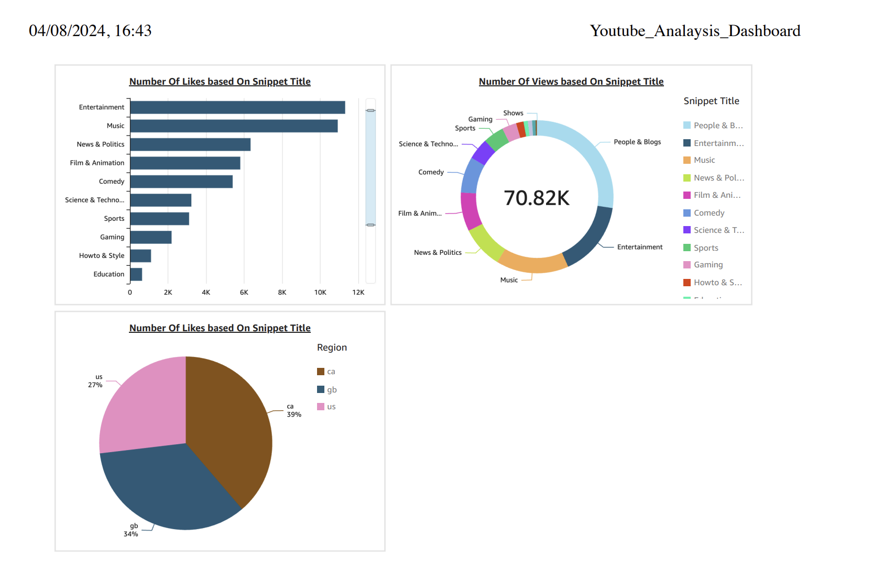

# Youtube Trending Data Analysis- Data Engineering Project

This project is designed to securely manage, streamline, and analyze structured and semi-structured YouTube video data, focusing on video categories and trending metrics.

## Table of Contents

- [1. Project Objectives](#project-objectives)
- [2. Dataset Used](#dataset-used)
- [3. AWS Services Used](#aws-services-used)
- [4. Project Architecture and Step-by-Step Explanation of the Data Flow](#project-architecture-and-step-by-step-explanation-of-the-data-flow)

## Project Objectives
### 1. Data Ingestion
Data ingestion refers to the process of collecting and importing data from various sources into a storage system where it can be accessed and analyzed. This process involves gathering data in real-time or in batches and can include data from APIs, web scraping, databases, and other external sources.

### 2. Create ETL System
The ETL (Extract, Transform, Load) system is a data processing framework comprising:

1. Extract: Collecting raw data from various sources.
Transform: Cleaning, normalizing, and enriching the data to ensure quality and consistency.
2. Load: Storing the processed data into a target system for analysis.
3. This process streamlines the movement of data from source systems to storage solutions, preparing it for effective analysis and reporting.

### 3. Create Data Lake
A data lake is a centralized repository that stores large volumes of raw, structured, and unstructured data in its native format. It allows for scalable storage and flexible data processing, supporting advanced analytics and machine learning.

### 4. Provide Scalability
Scalability ensures that the system can handle increasing volumes of data efficiently by expanding resources as needed. This involves designing the architecture to accommodate growing data sizes without compromising performance.

### 5. Use Cloud Service
Cloud computing, specifically using AWS, enables processing and managing large datasets that exceed local computing capacity. AWS provides scalable resources and services to handle extensive data operations effectively.

### 6. Create Dashboard
Develop a dashboard to visualize and analyze data, providing actionable insights and answers to predefined questions. The dashboard will facilitate data-driven decision-making by presenting key metrics and trends clearly.

## Dataset Used
The Kaggle dataset includes CSV files with statistics on daily trending YouTube videos over several months. Each file represents a region and contains data such as video titles, channel names, publication times, views, likes, dislikes, and comment counts. It also includes a category_id field specific to each region's JSON file.

[Dataset on Kaggle](https://www.kaggle.com/datasets/datasnaek/youtube-new)

## AWS Services Used

### 1. Amazon S3
Amazon S3 (Simple Storage Service) is an object storage service that provides scalable, durable, and secure storage. In this project, Amazon S3 is used as the central repository to store raw, cleaned, and processed data throughout the analysis pipeline.

### 2. AWS IAM
AWS Identity and Access Management (IAM) allows you to manage access to AWS resources securely. In this project, IAM is used to create IAM user and necessary roles that governs access permissions, ensuring secure operations and management of the AWS services utilized.

### 3. Amazon QuickSight
Amazon QuickSight is a scalable, serverless business intelligence (BI) service for creating interactive dashboards and reports. In this project, QuickSight is used to develop dashboards that provide visual insights and facilitate data-driven decision-making.

### 4. AWS Glue
AWS Glue is a serverless data integration service designed for discovering, preparing, and combining data. In this project, AWS Glue is used to orchestrate ETL processes, transforming and loading data into a data lake for further analysis.

### 5. AWS Lambda
AWS Lambda is a serverless computing service that runs code in response to events without managing servers. In this project, Lambda functions are employed to clean and process data. The processed data is then stored back into S3, using AWS Glue for data integration.

### 6. AWS Athena
AWS Athena is an interactive query service that allows direct querying of data stored in S3 using SQL. In this project, Athena is used to perform ad-hoc queries and analyze data directly within S3, eliminating the need for data migration to separate databases.

## Project Architecture and Step-by-Step Explanation of the Data Flow

1. Data Ingestion: 
The project starts with data ingestion, where data is downloaded from kaggle and uploaded as a bulk to S3-bucket. ( Using cmd- line interface ) 
	[s3-cli-commands.sh](s3_cli_commands.sh)

2. Data Lake Setup: 
Once the data is ingested, it is stored in a data lake within Amazon S3. The data lake consists of three main areas:

	- Landing Area: This is where the raw data is initially stored.
	- Cleansed/Enriched Area: After processing, the cleaned and enriched data is stored here.
	- Analytics/Reporting Area: This area contains data that is ready for analysis and reporting.

3. Data Processing:  The data processing step involves transforming the raw data into a more usable format. This is achieved using AWS Glue and AWS Lambda:

	- AWS Glue: Used for ETL (Extract, Transform, Load) processes. It automates the discovery, preparation, and transformation of data. Glue jobs can clean and normalize the data before moving it to the Cleansed/Enriched Area of the data lake.
	- AWS Lambda: Serverless functions that handle specific processing tasks. These functions can trigger on events, such as new data being added to the S3 bucket, to process and clean the data before it is stored in the Cleansed/Enriched Area.
	
4. Data Catalog and Classification: 
AWS Glue also provides a Data Catalog, which helps in organizing the data. It maintains a catalog of metadata, making it easier to locate and classify the data stored in the data lake. This cataloging and classification enable efficient querying and management of the data.

5. Analytical Data Access: Processed data needs to be accessed for analysis. This is done through various AWS services:

6. AWS Athena: An interactive query service that allows SQL queries directly on the data stored in S3. It enables quick, ad-hoc analysis without the need to move data to another database.
Redshift (Optional): A data warehouse service that can be used for more complex queries and analysis if needed.

6. Data Access API: An API layer provides secure and controlled access to the analytical data. This layer ensures that only authorized systems and users can access the data, adhering to the security policies defined by AWS IAM.

7. Monitoring and Alerting : To ensure the smooth operation of the data pipeline, monitoring and alerting are implemented using AWS CloudWatch. This service monitors the performance and health of the AWS resources used in the project, generating alerts in case of any issues.

8. Target Systems for Analytics : The processed and analyzed data can be visualized and further analyzed using various analytics tools:

	- Amazon QuickSight: Used to create interactive dashboards and reports, providing visual insights.
	- 

## Citations
[Youtube Link](https://youtu.be/yZKJFKu49Dk?si=GX6IDWYsOTjpC7DI)
	

 
 
  

 

 
